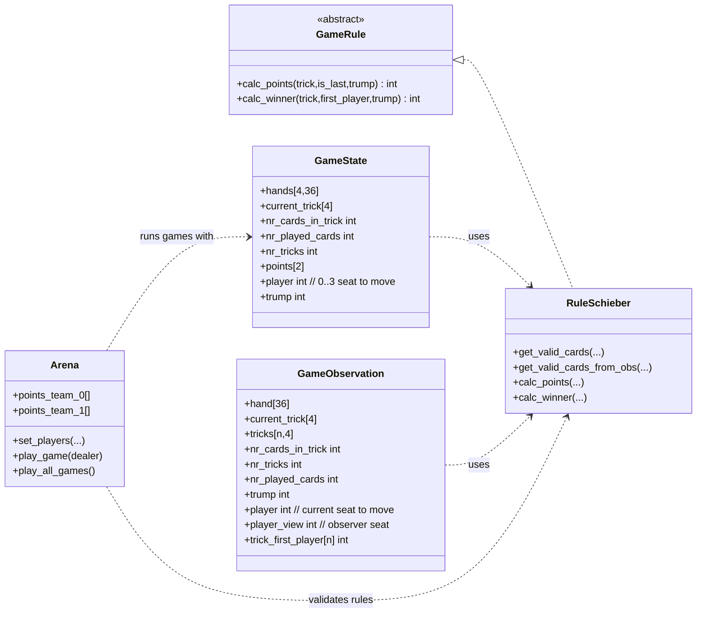
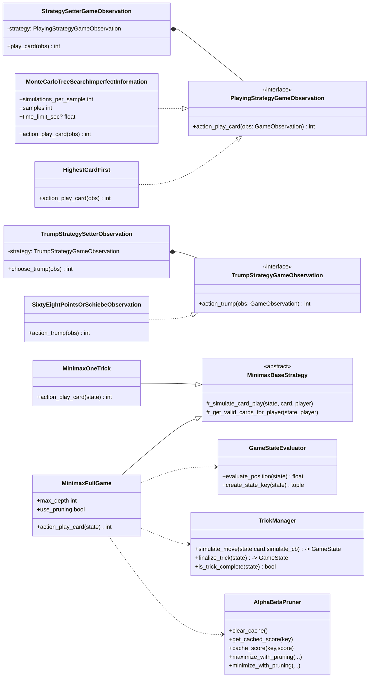
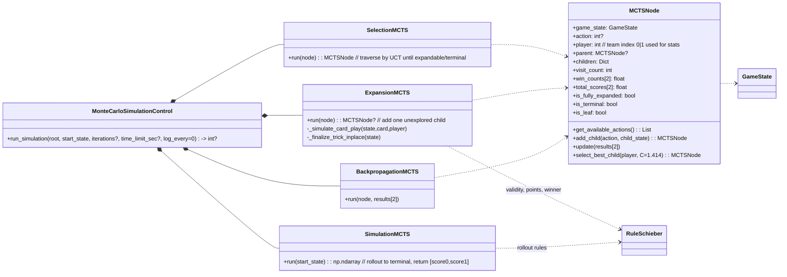
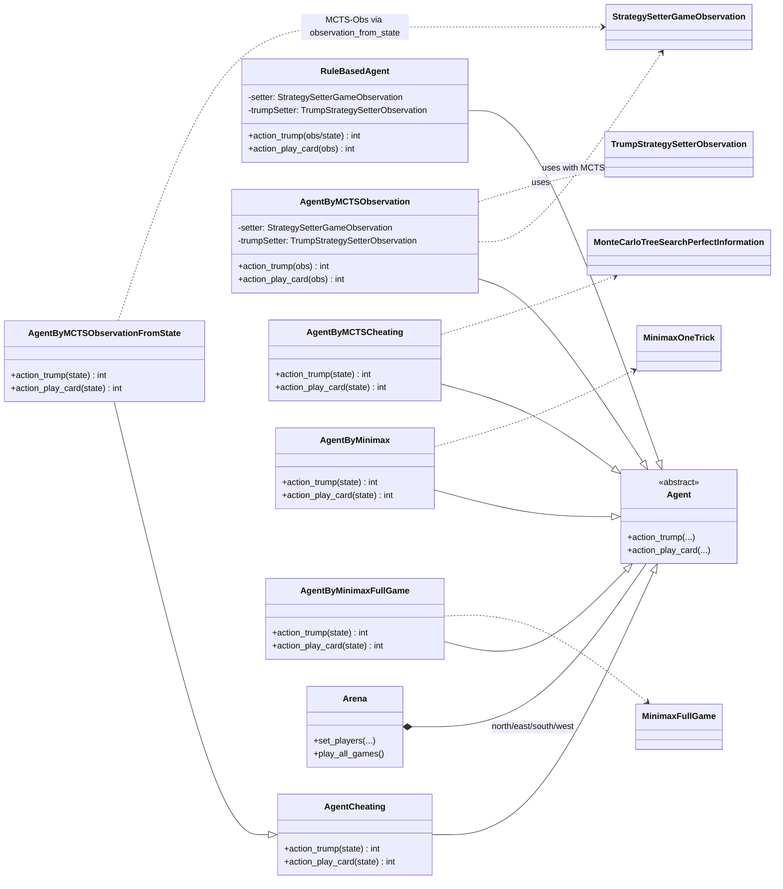

# Mermaid UML Architecture Diagrams

This document provides Mermaid class diagrams for the main parts of the project: core game model, strategy interfaces and implementations, MCTS helpers, and agents wiring. These diagrams reflect the current codebase at the time of creation.

## Core game model

## Strategy interfaces, setters, and implementations

## MCTS helpers

## Agents and wiring

---

Notes:
- Diagrams emphasize the main architectural elements rather than every class or function.
- Minimax helpers are under `jass/strategies/implementations/minimax_helper/`.
 - MCTS helpers live alongside the MCTS strategy implementation under `jass/strategies/implementations/play_strategies/`.
- Agents wire concrete strategies via setters and are orchestrated by the `Arena`.

Hints for viewing:
- VS Code displays Mermaid in Markdown previews (Ctrl+Shift+V).
- Alternatively, paste into the Mermaid Live Editor to export images.