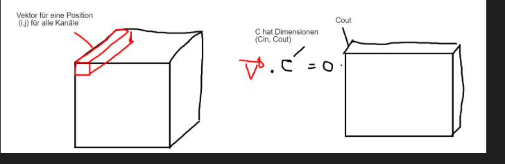

## CNN Agent

- CNN Agent soll Entscheidung für das Spielen der nächsten Karte fällen (`play_card`).
- CNN mit 9x4 Karten, welche den Input des Spielers repräsentiert (1 wenn Karte im Deck des Spielers ist, ansonsten 0). Es sind nur die Karten eines einzelnen Spielers bekannt.
- Zusätzlich 36 Eingänge, welche die gespielten Karten im aktuellen Spiel anzeigen.
- Zusätzliche 36 Eingänge für die gespielten Karten in diesem Stich.
- Zusätzlich 6 x 36 Eingänge bzw. 6x (9x4) Grids. Jeder Grid beinhaltet die Trump Information für eine Color. Jedes Inputneuron eines gleichen 9x4 Grid hat dieselbe Aktivierung. Es ermöglicht dann dem Convolutional Kernel, dass bei jedem Schritt die komplette Trump Information vorhanden ist.

### CNN-Agent Output
- Wahrscheinlichkeitsverteilung über alle 36 Karten

### Training
- Trainingsdaten liegen als newline-delimited JSON Dateien unter `jass/cnn/Data/games`.
- Trainingsskript starten mit `python -m jass.cnn.train_cnn --data-dir jass/cnn/Data/games --save-path checkpoints/cnn_policy.pt`.
- Wichtige Parameter: `--epochs`, `--batch-size`, `--max-games` (Begrenzung pro Epoche), `--device` (z.B. `cuda`).
- Das Skript legt automatisch ein Validationset pro Datei-Split an und speichert die gelernten Gewichte an dem angegebenen Pfad.

